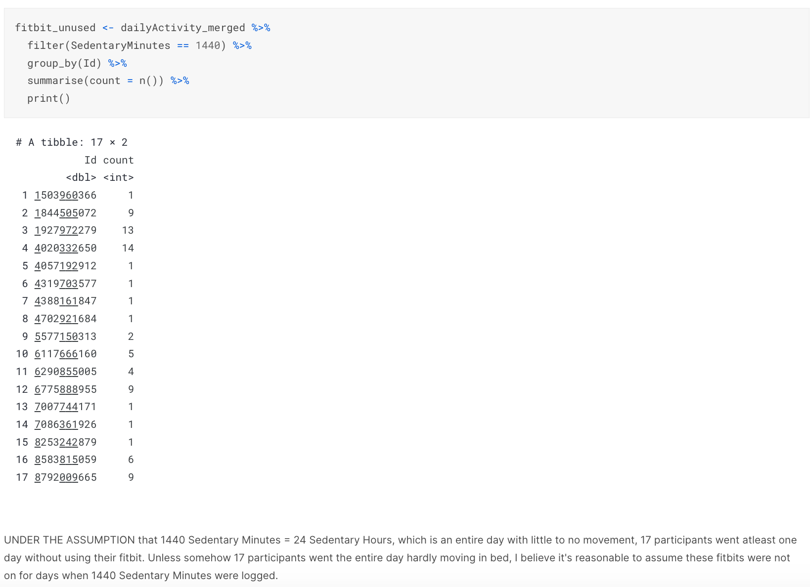

# BELLABEAT CASE STUDY

## New and Upcoming Business in Women's Health
Bellabeat is a high-tech company that manufactures health-focused smart products. Since it was founded in 2013, Bellabeat has grown rapidly and quickly positioned itself as a tech-driven wellness company for women; but Bellabeat can grow so much more! Urška Sršen and Sando Mur, Bellabeat's founders, know that an analysis of Bellabeat’s available consumer data would reveal more opportunities for growth.

### Business Objective:
Focus on one Bellabeat product and analyze smart device usage data in order to gain insight into how people are already using their smart devices.

### Questions to Consider:
What are some trends in smart device usage?
How could these trends apply to Bellabeat customers?
How could these trends help influence Bellabeat marketing strategy?

### Steps & Notes for Preparation:
Datasets information: Contains personal fitness tracker from thirty fitbit users. Thirty-three eligible Fitbit users consented to the submission of personal tracker data, including minute-level output for physical activity, heart rate, and sleep monitoring. It includes information about daily activity, steps, and heart rate that can be used to explore users’ habits. This dataset was derived from FitBit Fitness Tracker Data, which establishes reliablity, orginality, and credibility.

Tools: R is able to clean, transform, analyze and visualize data all in one place. The datasets I've used are small enough to work in R, if not SQL would have been used.

# Identifying Trends
### How Often did Participants Use Their Fitbit?

Here I wanted to know if the participants kept their fitbits on the entire month, all seconds of the day. Considering this could significantly change the data. There wasn't specific variable that asked participants if they'd worn the fitbit on a given date, so I had to get a little creative with figuring out how to determine this. The following code explains this process.

UNDER THE ASSUMPTION that 1440 Sedentary Minutes = 24 Sedentary Hours, which is an entire day with little to no movement, 17 participants went atleast one day without using their fitbit. Unless somehow 17 participants went the entire day hardly moving in bed, I believe it's reasonable to assume these fitbits were not on for days when 1440 Sedentary Minutes were logged.

Based on this assumption, I calculated some percentages based on the amount of days recorded.



About half of the participants kept their fitbit on the entire month of observation. A quarter did not use their fitbit on one day. 12% did not use their fitbit between 1-7 days and 16% did not use their fitbit for a week. However, these days where the fitbit was unused, are still being counted as Sedentary minutes, skewing our data to show that the majority of these fitbit participants don't move as much as they actually do when wearing the fitbit. Let's see what happens when we take these unused fitbit days out.
